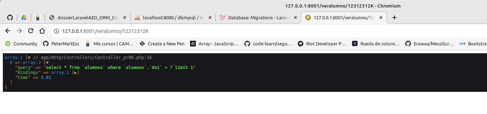
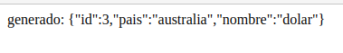
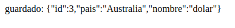

<div style="text-align: justify;">

# Documentacion de practicas Laravel con Eloquent

#### Introduccion

En el siguiente documento iremos viendo las diferentes practicas realizadas del dossier de Laravel específico de Eloquent ORM. 

Para subir el proyecto al zip, tuve que borrar la carpeta de vendor, y así reducirle el peso.

Para restaurar:

```
$ composer install

$ php artisan key:generate
```

## Índice:

- [Practicas 1 - 5](#Practica-1)

- [Practicas 5 - 10](#Practica-5)

- [Practicas 10 - 15](#Practica-10)

- [Practicas 15 - 20](#Practica-15)

#### Practica 1

Crear un elemento del modelo mediante php artisan para luego guardarlo en
sqlite. En concreto crearemos: Alumno ( para esta prueba lo único que guardaremos será el
nombre apellidos y edad ) 

Realizado el modelo Alumno y las migraciones pertinentes

```
dossier-eloquent/dossier-proyecto
```

#### Practica 2

Realizar la migración para Alumno ( para esta prueba lo único que
guardaremos será el nombre apellidos y edad ) Comprobar mediante el addon sqlite que se
ha creado en la database

Se modifica el Modelo Alumno para los nuevos datos, y de igual forma las migraciones cambian a más datos

```
dossier-eloquent/pr01-pr02
```

#### Practica 3

Haciendo uso de la documentación oficial y ejecutando las migraciones Crear
una tabla Productos con string nombre y también un campo llamado precio que soporte
precios con decimales. Así como un campo cantidad que represente la cantidad de producto
de la que disponemos

```
dossier-eloquent/pr03
```

#### Practica 4

Esta es una práctica de autoformación. Buscar como hacer uso de los: “seeder”
y rellenar datos aleatorios en la tabla productos de la base de datos con ese sistema

#### Practica 5

Hacer los cambios pertinentes en: .env para que la aplicación use la base de
datos mysql con las tablas pertinentes para instituto matrículas. Crear con generate:model
las clases correspondientes .
Nota: observar que posiblemente haya que borrar las clase Alumno de prácticas anteriores

```
dossier-eloquent/pr-instituto
```

#### Practica 6

Construir la ruta para las peticiones GET a: veralumno que nos lleve a un
controlador Este controlador hará la búsqueda por id del alumno y lo enviará a una vista
que mostrará la información

Se realiza en la carpeta pr-instituto. Podemos verlo en el Controlador_pr06

```
Route::get('/veralumno/{dni}', [Controller_pr06::class, 'findAlumnoById']);
```

```
dossier-eloquent/pr-instituto/app/Http/Controllers/Controller_pr06
```

#### Practica 7

Modificar la actividad anterior de tal forma que se sepa que está ejecutando en
la base de datos como sentencia. Toma captura de pantalla del dd() obtenido

Se realiza en el proyecto pr-instituto, en el mismo Controller_pr06

```
Route::get('/veralumno/{dni}', [Controller_pr06::class, 'findAlumnoById']);
```

<br/>

Captura:




#### Practica 8

Listar todos los alumnos de nuestra base de datos ( debe mostrarse en una vista
blade ) 

Realizado en pr-instituto Controller_pr08

```
Route::get('/veralumnos', [Controller_pr08::class, 'findAllAlumnos']);
```

#### Practica 9

Buscar mediante where y mostrar en una vista las matrículas anteriores a 2021
obtener la consulta sql que ejecuta Eloquent en la base de datos

Realizado en pr-instituto Controller_pr09

```
Route::get('/matriculas/antes/2019', [Controller_pr09::class, 'matriculasAnterior2019']);
```

#### Practica 10

Continuando con la anterior, ordenaremos las matrículas por fecha y
ejecutaremos un take(1) ( seguir el ejemplo de encima: :where(..l)->orderBy(...)->take(1) )
y finalmente terminaremos con un get() Mediante var_dump() o dd() veremos que
estructura nos devuelve. Hacer lo mismo de nuevo pero ahora en lugar de terminar con un
get() terminamos con un first() ¿ da estructuras diferentes ? Nota: observar que la idea de
first es tomar un objeto y get era el conjunto de objetos

Da estructuras diferentes. El fist devuelve solo el objeto matricula, mientras que el get devuelve un array de un
unico elemento que contiene el objeto matricula.

```
Route::get('/matriculasComparar', [Controller_pr10::class, 'matriculasComparar']);
```

#### Practica 11

Obtener la cantidad total de asignaturas de 1ºDAM y mostrarlo

```
Route::get('/matriculasContar', [Controller_pr11::class, 'matriculasContar']);
```

#### Practica 12

Crear 2 nuevas asignaturas Siguiendo lo que se detallado: Una de 1ºDAM
mediante new Asignatura() y save() y otra de 2ºDAM mediante: Asignatura::create() Se
debe haber especificado mediante: fillable los campos que se aceptan para rellenar en la
DB.

Realizados en el Controller_12 de pr-instituto

```
dossier-eloquent/pr-instituto/app/Http/Controllers/Controller_pr12
```

#### Practica 13

Modificar las dos asignaturas anteriores de tal forma que la que era de
primero pase a segundo y viceversa. Finalmente borrar de la base de datos la que sea de
segundo

```
Route::get('/intercambiarAsignaturasCurso', [Controller_pr13::class, 'updateAsignaturasPr12']);
```

#### Practica 14

Basándose en el ejemplo anterior ( usando Historico::create ) crear un
histórico para la moneda dólar que sea para la fecha actual al tipo de cambio actual con el
euro

```
Route::get('/crearHistorico', [Controller_pr14::class, 'createHistorico']);
```


#### Practica 15

Crear un histórico para la moneda dólar que sea para la fecha de mañana con
tipo de cambio con el euro actual menos un céntimo, usando save() y associate()

```
Route::get('/crearHistoricoAsociate', [Controller_pr15::class, 'crearNuevoHistoricoPr15']);
```

#### Practica 16

Crear un histórico para la moneda dólar que sea para la fecha de pasado
mañana con tipo de cambio con el euro actual menos dos céntimos usando save() desde la
entidad Moneda ( siguiendo el ejemplo que acabamos de ver ) 

```
Route::get('/pr16CrearHistorico', [Controller_Pr16::class, 'saveHistoricoPr16']);
```

#### Practica 17

Crear una moneda: dólar, país australia y guardarla con: create(). Mostrar el
resultado obtenido haciendo una búsqueda por país: australia. Luego modificarla poniendo
en mayúscula Australia usando save(). Toma captura de pantalla que muestre la salida en
pantalla solicitada

```
Route::get('/pr17CrearMoneda', [Controller_Pr17::class, 'crearNuevaMonedaPr17']);
```

```
Route::get('/pr17ActualizarMoneda', [Controller_Pr17::class, 'saveMonedaPr17']);
```
<br/>

Capturas:



<br/>




#### Practica 18


#### Practica 19

Crear un miniformulario donde se introduzca una moneda y un histórico.
Utilizar una transacción de tal forma que si al guardar un histórico que no tiene un tipo de
cambio numérico sino que el usuario ha introducido texto, se deshaga el guardado de los
dos objetos

```

```
